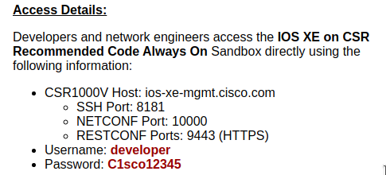

### Ansible Netwerk automatie

Met Ansible zijn de mogelijkheden oneindig. In deze playbook gaan proberen om een router te configureren. Dit doen we door gebruik maken van [Cisco devnet sandbox](https://devnetsandbox.cisco.com/RM/Topology). 

We maken gebruik van de volgende sandboxes:

- [IOS XE on CSR Latest Code Always On](https://devnetsandbox.cisco.com/RM/Diagram/Index/38ded1f0-16ce-43f2-8df5-43a40ebf752e?diagramType=Topology)

- [IOS XE on CSR Recommended Code Always On](https://devnetsandbox.cisco.com/RM/Diagram/Index/27d9747a-db48-4565-8d44-df318fce37ad?diagramType=Topology)

Onder Access Details kan je de configuratie van de routers terugvinden:



We zetten de 2 routers in onze inventory volgens de Acces Details:
```bash
[routers]
ios-xe-mgmt.cisco.com 
ios-xe-mgmt-latest.cisco.com

[routers:vars]
ansible_port=8181
ansible_network_os=ios
ansible_user=developer
ansible_password=C1sco12345
ansible_connection=network_cli
```

In het bestand ansible.cnfg gaan we een kleine wijziging doen. Dit is omdat we normaal gezien telkens de ssh key moeten kopieëren. We zetten dit even af.

```bash
# uncomment this to disable SSH key host checking
host_key_checking = False
```

Nu kunnen we onze omgeving even testen met een simpele ping:

```bash
ansible routers -i inventory -m ping
```

#### Toevoegen van een banner

```yml
- name: Configureren van Router
  hosts: routers
  tasks:
  - name: Banner toevoegen
    ios_banner:
      banner: login
      text: Wat zijn 8 hobbits?
      state: present

  - name: loopback
    ios_interface:
      name: Loopback21
      state: present 
```